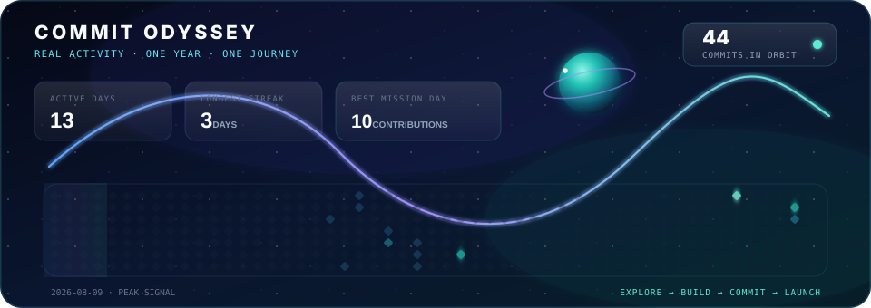

<p align="center">
  
</p>

<p align="center">
  <strong>Full-stack developer building useful digital products.</strong><br />
  Next.js · React · TypeScript · Django · PostgreSQL · AI/ML
</p>

<p align="center">
  <a href="https://github.com/bigyancodes?tab=repositories">Explore my work</a>
</p>

## `./about-me`

```ts
const bigyan = {
  role: "Full-stack developer",
  focus: "Useful, polished digital products",
  stack: ["Next.js", "React", "TypeScript", "Django", "PostgreSQL"],
  exploring: ["AI/ML", "3D experiences", "motion design"],
  approach: "Build → learn → improve",
};
```

I enjoy turning real problems into responsive web experiences—from healthcare systems and learning tools to interactive platforms. I care about clear user flows, thoughtful motion, and code that another developer can understand.

## `./toolbox`

<p align="center">
  <code>TypeScript</code>&nbsp;
  <code>JavaScript</code>&nbsp;
  <code>React</code>&nbsp;
  <code>Next.js</code>&nbsp;
  <code>Python</code>&nbsp;
  <code>Django</code>&nbsp;
  <code>PostgreSQL</code>&nbsp;
  <code>Tailwind CSS</code>&nbsp;
  <code>Git</code>
</p>

## `./featured-work`

<table>
  <tr>
    <td width="50%" valign="top">
      <h3><a href="https://github.com/bigyancodes/Inspire-2026">Inspire 2026</a></h3>
      <p>Modern event-focused experience with responsive UI, motion, and email workflows.</p>
      <p><code>Next.js</code> <code>TypeScript</code> <code>Tailwind CSS</code> <code>Framer Motion</code></p>
    </td>
    <td width="50%" valign="top">
      <h3><a href="https://github.com/bigyancodes/AssignmentBros">AssignmentBros</a></h3>
      <p>Polished academic-support frontend with rich, animated interactions.</p>
      <p><code>Next.js</code> <code>React</code> <code>GSAP</code> <code>Rive</code></p>
    </td>
  </tr>
  <tr>
    <td width="50%" valign="top">
      <h3><a href="https://github.com/bigyancodes/sajilo_cms">SajiloCMS</a></h3>
      <p>Clinic platform covering EHR, appointments, telemedicine, pharmacy, and operations.</p>
      <p><code>Django</code> <code>React</code> <code>PostgreSQL</code></p>
    </td>
    <td width="50%" valign="top">
      <h3><a href="https://github.com/bigyancodes/truthguard-hackathon2025">TruthGuard</a></h3>
      <p>Media-literacy learning experience created for the UNESCO Youth Hackathon 2025.</p>
      <p><code>HTML</code> <code>CSS</code> <code>JavaScript</code></p>
    </td>
  </tr>
</table>

## `./commit-odyssey`

An original space journey generated from my public GitHub contribution calendar—every glowing star is part of the real activity story.

<p align="center">
  
</p>

<p align="center">
  <sub>Open to building thoughtful products, learning in public, and making each project better than the last.</sub>
</p>
